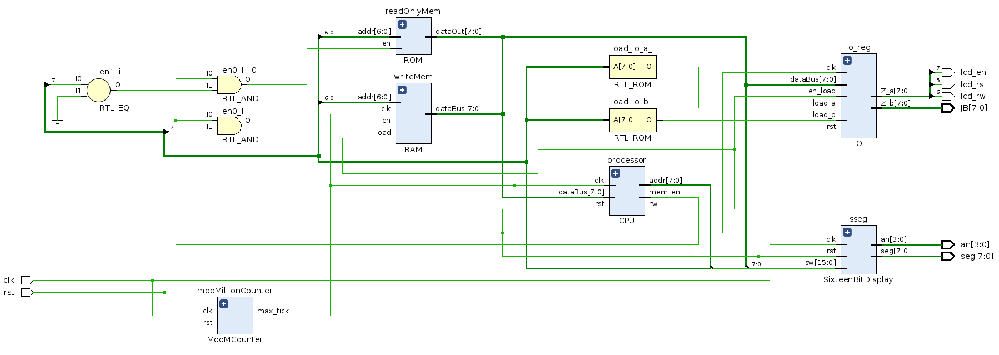

<!-- https://thisdavej.com/copy-table-in-excel-and-paste-as-a-markdown-table/ -->
src/computer/Computer8Bit.srcs/sources_1/new/
# 8 Bit Computer 


<!-- TABLE OF CONTENTS -->
## Table of Contents

* [About the Project](#about-the-project)
	* [Computer](#computer)
		* [CPU](#cpu)
	* [Assembler](#assembler)
* [Usage](#usage)
* [License](#license)
* [Contact](#contact)


<!-- ABOUT THE PROJECT -->
## About The Project

This project consists of an 8 bit computer simulated in VHDL, as well as an assembler written in C++. My goal was to get an incresed understanding of computer architecture and VHDL during the christmas vacation of 2020. 

The main inspiration for this project came from [Ben Eater](https://eater.net/), who on his youtube channel has done detailed implementations of an 8-bit computer and a 6502 computer, on breadboards. My computer ended up being quite different, as it is of course a lot easier to implement a large project in VHDL than on breadboards. However, his excellent explanations gave me the understanding necessary to even attempt a project like this. 

For the CPU design, I have drawn inspiration from the MOS 6502 (because Ben Eater gave a great tutorial on it), and the MIPS architecture, as it is what we learned about in school. However, a lot of stuff was done of the top of my head, and will probably not resemble any sort of best practice.
 
The assembler is just a tool for being to able write instructions for the computer, without going mad, so efficiancy or elegancy has not been emphasized at all. 


## Computer
[Source Code](src/computer/Computer8Bit.srcs/sources_1/new/Computer.vhd)

The computer consists of the following modules:

* CPU
* ROM
* RAM
* IO

and the top level structure can be seen in the figure below:


For now, the IO only handles output, and is pretty much hardcoded to work with an HD44780 LCD display. The seven segment display is embedded on the Basys3, and shows the current contents on the address and data bus. 

The modMillionCounter is there to provide a reduced clock speed, as the Basys3 clock runs at 100MHz

When generating the bitstream, the ROM will be filled with the currently selected program, and the program counter wil start reading at address 0.

For simplicity, the data bus and address bus are 8 bits wide. RAM, ROM and IO are all accessed via the same buses, and the address scheme can be seen in the table below:

```
| Addr From | Addr To | Addr From | Addr To | Addr From | Addr To  | Slots | Meant for   | Device |
|-----------|---------|-----------|---------|-----------|----------|-------|-------------|--------|
| 0         | 127     | 00        | 7F      | 00000000  | 01111111 | 128   | Programs    | ROM    |
| 128       | 143     | 80        | 8F      | 10000000  | 10001111 | 16    | Stack       | RAM    |
| 144       | 251     | 90        | FB      | 10010000  | 11111011 | 108   | Free Memory | RAM    |
| 252       | 252     | FC        | FC      | 11111100  | 11111100 | 1     | IOB Set     | RAM    |
| 253       | 253     | FD        | FD      | 11111101  | 11111101 | 1     | IOB Write   | RAM    |
| 254       | 254     | FE        | FE      | 11111110  | 11111110 | 1     | IOA Set     | RAM    |
| 255       | 255     | FF        | FF      | 11111111  | 11111111 | 1     | IOA Write   | RAM    |
```

#### CPU

The CPU consists of the following modules:

* Control Unit
* ALU
* Register Bank (containing general purpose registers)
* Special Purpose Registers:
	* Program Counter
	* Stack Pointer
	* Index Register 


##### Registers

RegisterBank contains several PIPO-registers, which are illustrated in the table below:

```
| Mnemonic | Bin Value | Dec Value | Reg Name                |
|----------|-----------|-----------|-------------------------|
| no       | 000       | 0         | No Register             |
| ir       | 001       | 1         | Instruction Register 1  |
| iir      | 010       | 2         | Instruction Register 2  |
| xr       | 011       | 3         | X Register              |
| yr       | 100       | 4         | Y Register              |
| mr       | 101       | 5         | Memory Address Register |
| hi       | 110       | 6         | HI register             |
| lo       | 111       | 7         | LO register             |
```

The special purpose registers I found made the most sense to implement as separate modules, and are illustrated in the table below:
```
| Reg Name        | Mnemonic |
|-----------------|----------|
| Program Counter | pc       |
| Stack Pointer   | sp       |
| Index Register  | ind      |
| Status Register | sr       |
```

##### ALU

The ALU will perform an operation on either the X register, the Y register or both. The opcodes for the ALU, are used internally by the Control Unit, and can be seen in the table below: 

```
| Alu Code | BinValue | Operation        |
|----------|----------|------------------|
| 0        | 00000    | NOOP             |
| 1        | 00001    | Add              |
| 2        | 00010    | Add Unsigned     |
| 3        | 00011    | Sub              |
| 4        | 00100    | Sub Unsigned     |
| 5        | 00101    | Equal            |
| 6        | 00110    | Greater or Equal |
| 7        | 00111    | Greater Than     |
| 8        | 01000    | AND              |
| 9        | 01001    | OR               |
| 10       | 01010    | NOTX             |
| 11       | 01011    | NOTY             |
| 12       | 01100    | XOR              |
| 13       | 01101    | XNOR             |
| 14       | 01110    | SXL              |
| 15       | 01111    | SXR              |
| 16       | 10000    | SYL              |
| 17       | 10001    | SYR              |
| 18       | 10010    | MULL             |
| 19       | 10011    | MULU             |
| 20       | 10100    | DIVQ             |
| 21       | 10101    | DIVR             |
```
Most of the operations are self-explanatory, however 18 through 21 stands out. MULL will multiply the the two 8-bit inputs, and return the lower 8 bits of this calculation. MULU on the other hand, will return the upper 8 bits of this multiplication. 

DIVQ returns the quotient of the division, while DIVR returns the remainder of the division. 

Instructions 14 - 20 are bitshift instructions. 

##### Instruction Set Architecture/Control Unit

As mentioned previously much of the design is inspired by 6502 and MIPS and the ISA is no exception. 

For simplicity I wanted fixed-length instructions. However, as the bus is only 8 bits wide, I did not want to spend too many cycles fetching instructions with no content. Still, I wanted a fair amount of instructions, so 2 byte instructions, seemed optimal in this case. How they are formatted can be seen in the table below:

```
| opcode | regArg | Addr/const/regArg |
|--------|--------|-------------------|
| 00000  | 000    | 00000000          |
```

The instruction set can be seen in the table below:

```
| Hex Val | opcode | regArg    | Addr/const/reg-arg | Description                                                            |
|---------|--------|-----------|--------------------|------------------------------------------------------------------------|
| 0       | nop    | N/A       | N/A                | No operation                                                           |
| 1       | ldw    | destReg   | address            | Loads word at address into dest reg                                    |
| 2       | ldi    | destReg   | constant           | Loads constant into dest reg                                           |
| 3       | stw    | sourceReg | address            | Stores word in source reg to address                                   |
| 4       | add    | destReg   | N/A                | Adds X and Y reg, stores to dest reg, interprets as 2’s Complement     |
| 5       | addu   | destReg   | N/A                | Adds X and Y reg, stores to dest reg, interprets as unsigned           |
| 6       | sub    | destReg   | N/A                | X – Y, stores in dest reg, interprets as  unsigned                     |
| 7       | subu   | destReg   | N/A                | X – Y, stores in dest reg, interprets as 2’s Complement                |
| 8       | jmp    | N/A       | address            | loads PC with addressargument. Increments stackpointer with current pc |
| 9       | ret    | N/A       | N/A                | decrement stackpointer, load ret address into program counter          |
| A       | beq    | N/A       | address            | X = Y? Load PC with address                                            |
| B       | bne    | N/A       | address            | X != Y? Load PC with address                                           |
| C       | bgt    | N/A       | address            | X > Y? Load PC with address                                            |
| D       | bge    | N/A       | address            | X >= Y? Load PC with address                                           |
| E       | mov    | destreg   | sourceReg          | move  src reg → dest reg                                               |
| F       | psh    | sourceReg | N/A                | Push  src reg onto stack                                               |
| 10      | pul    | destReg   | N/A                | Pull word off stack, place in dest reg                                 |
| 11      | and    | destReg   | N/A                | X AND Y,  stores in dest reg                                           |
| 12      | or     | destReg   | N/A                | X OR Y,  stores in destReg                                             |
| 13      | not    | destReg   | N/A                | NOT operator,  source = destReg, X or Y  reg possible                  |
| 14      | xor    | destReg   | N/A                | X XOR Y,  stores in dest reg                                           |
| 15      | xnor   | destReg   | N/A                | X XNOR Y,  stores in dest reg                                          |
| 16      | sll    | desReg    | N/A                | <<, src = dest (X or Y)                                                |
| 17      | srl    | desReg    | N/A                | >>, src = dest (X or Y)                                                |
| 18      | mul    | N/A       | N/A                | X*Y, upper 8 bits → HI, lower 8 bits → LO                              |
| 19      | div    | N/A       | N/A                | X/Y, quotient → HI, remainder → LO, not yet implemented.               |
| 1A      | inl    | N/A       | constant           | Load index register with constant                                      |
| 1B      | ini    | N/A       | constant           | Increment index register by constant                                   |
| 1C      | -      | --        | --                 | --                                                                     |
| 1D      | --     | --        | --                 | --                                                                     |
| 1E      | --     | --        | --                 | --                                                                     |
| 1F      | --     | --        | --                 | --                                                                     |
```

The ISA is implemented in the control unit using a finite state machine. Some of the instructions take a single cycle, while others may take up to 3 cycles to execute. 

At first I envisioned the control unit to be modular, easy to change, and perhaps with pipelined execution. However, because of the limited time I had, everything had to be kind of thrown together and made to work. In other words, the control unit is in great need of improvement. 


## Assembler

An overview of the tokens accepted by the assembler can be seen in the table below:

```
| Token      | Example         | Description                                                     |
|------------|-----------------|-----------------------------------------------------------------|
| opcode     | mov             | All opcodes in ISA                                              |
| regArg     | xr              | All keywords found in register table                            |
| constArg   | 129 / #15 / ‘L’ | # interprets as hex, ‘’ interprets as ascii, else decimal       |
| addressArg | #$01FF / $28    | $ indicates address, # means hex. Otherwise decimal             |
| labelArg   | loop            | All those matching created labels                               |
| org        | .org (arg)      | Sets the address pointer when writing to file                   |
| word       | .word (arg)     | Stores a word in the current address                            |
| label      | loop:           | Creates a label at the current address                          |
| Default    | --              | If no token applies, the assembler will assume it is a constArg |
```

Example of simple program that adds two numbers and then loops forever. 

```assembly
	.org #$02 ; place following code at address 0x02
	ldw xr inta ; load contents of address 001E into register X
	ldw yr intb ; load contents of address 001F into register Y
	add xr ;  add contents of x and y register. Place result in x register
	stw xr #$F0 ; store the contents of x register at address 0xF0
loop:
	nop ; do nothing
	jmp loop ; jump to label 'loop'


	.org #$1E ; place following code at address 0x1E
inta:
	.word #05 ; place literal 0x5 at this address
intb:
	.word 15 ; place literal 15 at this address
char:
	.word 'L' ; place literal char L at this address
```

To assemble this, we run the command:
```
./assembler "prog.asm" "128"

From this, the assembler will generate the following machine code (with a newline after each byte).
```bin
00000000 00000000
00001011 00011110
00001100 00011111
00100011 00000000
00011011 11110000
00000000 00000000
01000000 00001010
00000000 00000000
00000000 00000000
00000000 00000000
00000000 00000000
00000000 00000000
00000000 00000000
00000000 00000000
00000000 00000000
00000101 00001111
01001100 00000000
00000000 00000000
*
00000000 00000000
```

## Example Programs
	
* [Hi, World](examples/hiWorld.asm)
* [Simple Add](examples/add.asm)
* [Noe annet]

<!-- USAGE -->
## Usage

The computer has been tested on a [Basys 3 Artix-7 FPGA](https://store.digilentinc.com/basys-3-artix-7-fpga-trainer-board-recommended-for-introductory-users/), and synthesized in [Xilinx Vivado 2020.2](https://www.xilinx.com/).

<!-- LICENSE -->
## License

Distributed under the MIT License. See [`LICENSE`](LICENSE) for more information.

<!-- CONTACT -->
## Contact

Kent Odde - kentodde89@gmail.com

Project Link: [https://github.com/oddek/8-bit-Computer](https://github.com/oddek/8-bit-Computer)


